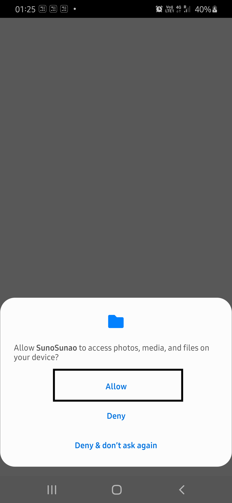

# SunoSunao
## Table of Contents

- [About](#about)
- [How to Install ](#how-to-install)
- [How to Use](#how-to-use)

# How to Install
- Click on apk file
- Click on view raw (it will download the app on your device)
- Now Install the app

# How to Use
- First give permission to the app for accessing phone storage
  
- Then Click on any of the song to play it
  - You can play songs of song/ album/ cloud tab.
  - You Share the song of your storage through this app (By clicking on menu and then share)
- If you want to upload a song on cloud then click on cloud tab and log in (using Google account)
  - Then play any song and click on three doted menu
  - There click on upload option (It will start uploading your song on cloud)
  
